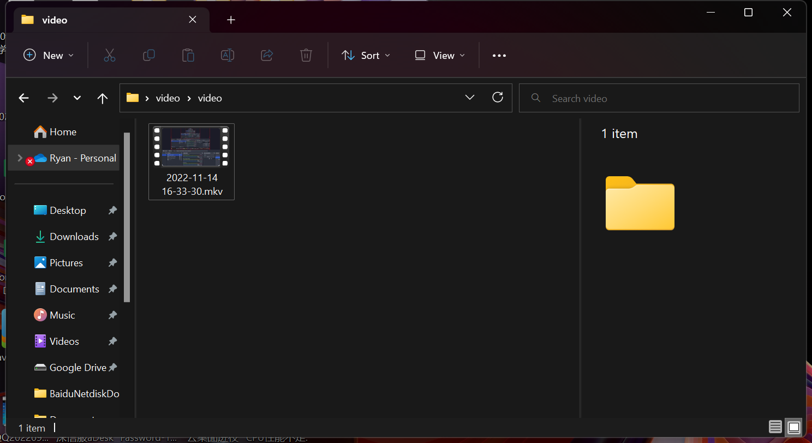
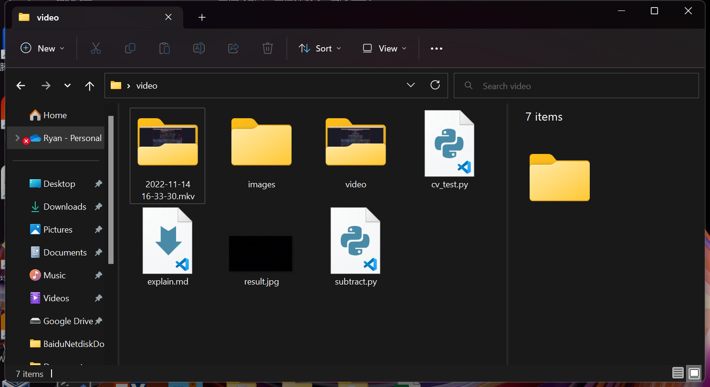

# Video2Img 说明

<p align="left">🇨🇳 中文简体  |  <a title="English" href="#">🇬🇧 English</a></p>

Edit Date:2022-11-14 19:14<br>
Author:Ryan Zhang

> 此python文件用于将视频格式文件转换为图片格式，默认采用视频帧率进行逐秒转换

## 文件链接
[Video2Img.py](https://github.com/hz157/weibo-spider/blob/main/source/Video2Img.py)
## 所需第三方库
该程序使用到open-cv的图像识别库
安装命令
```shell
pip install opencv-python
```
如果默认的pip安装慢或是失败可能是无法连接pip源镜像，可采用清华或是其他境内镜像源
```shell
pip install opencv-python -i https://pypi.tsinghua.edu.cn/simple
```

## 转换说明
程序执行会读取视频文件的总帧数以及视频的帧率，以帧率为间隔，每隔1s获取一帧画面转换为png图片并保存。程序设置了8位数的命名上限，可转换99999999帧内的视频，如需更高帧率，可自行修改Video2Img.py文件内的参数（**请注意Int变量格式的存储上限**）

## 使用说明
执行Python文件后，程序将自动读取运行目录位置，需要将所需的视频格式文件（不限制单一格式）放置在程序运行目录下的**video**文件夹当中 **（请勿在文件夹中放置非视频文件格式的文件）** <br> video文件夹内的所有文件将会被程序视作为需要进行转化的视频文件

<br>
程序执行过程不会有提示信息，除非使用Python debug 出错。执行完毕后，将会在程序运行目录下生成多个文件夹（具体数量取决于video内视频格式文件数量）并以video文件夹的文件名称命名



