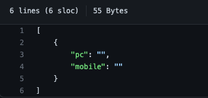
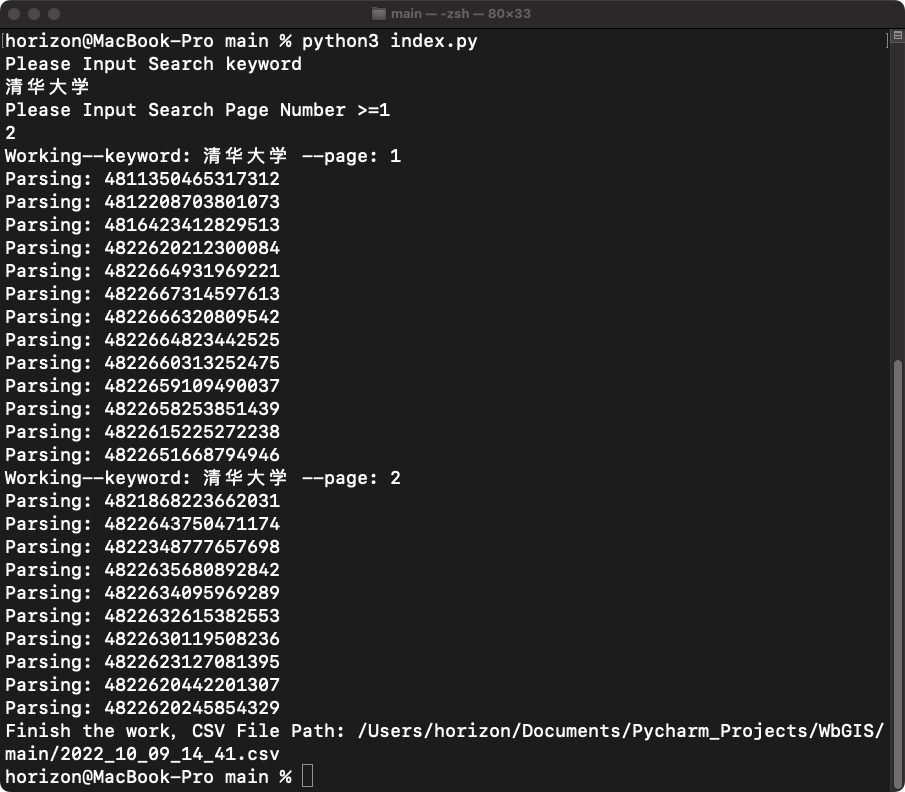
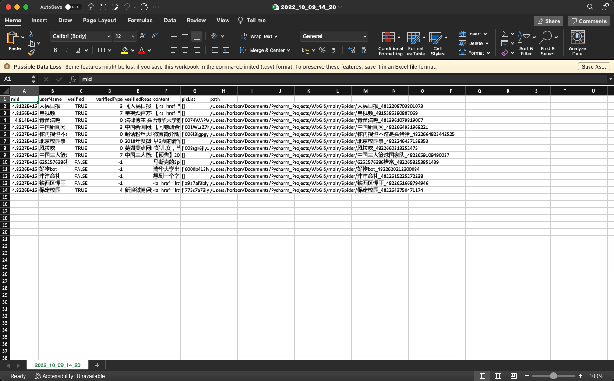

# 使用说明
最后编辑日期： 2022-10-08
> 因本人是个懒狗，不想写微博登录，所以使用该脚本前需要手动获取两个Cookie，并将Cookie写入cookie.json文件当中
> - 微博PC端Cookie
> - 微博Moblie端Cookie 
> <br> 获取Cookie的方法 -> <a href="#">获取Cookie方式说明</a>
> 
1. Clone <a href="/source">source</a>内的代码到本地后,修改cookie.json<br>

2. 使用python执行命令
```
python index.py
```
3. 根据脚本提示输入要搜索的关键字与检索页数（页数不足时会溢出）

4. 结束检索，提示CSV文件位置，csv记录了爬取的所有数据以及图片保存位置


